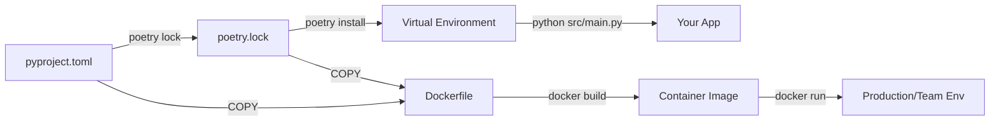

# ENGINEERING_LOG.md

## Sharingan Core Design Principles

_Last Updated: $(date)_

### 🔐 Security-First Principles

1. **Keep Humans in Control**: Exploitation is never fully automated. The AI can recommend actions, but a human must approve before any tool runs.
2. **Enforce Scope Before Action**: Validate every target against the approved engagement scope before doing anything.
3. **Harden Sharingan Itself**: Protect the tool with strong input validation, output sanitization, and least-privilege execution.
4. **Log Every Decision and Action**: Record all actions, decisions, and AI interactions with timestamp, operator, and context.
5. **Fail Safely by Default**: When something goes wrong, stop and ask for confirmation instead of continuing blindly.

### 🧠 AI Integration Principles

6. **AI Advises, Humans Execute**: Treat all AI output as suggestions that must be validated first.
7. **Keep Prompts Auditable**: Log AI prompts for traceability, while redacting sensitive data.
8. **Prefer Local Models**: Use local models (Qwen via Ollama) by default for privacy; cloud usage is optional.
9. **Validate AI Responses**: Check all AI output for scope compliance, safety, and relevance before showing it.

### 🏗️ Architecture Principles

10. **Build as Modular Plugins**: Each tool (nmap, ffuf, etc.) should be a self-contained module with a clear interface.
11. **Design for Concurrency Early**: Keep the architecture async-ready, even if the first implementation is synchronous.
12. **Favor Configuration Over Hardcoding**: Control behavior through config files whenever possible.
13. **Design for Testing**: Every module needs tests, and tests should run before merge.

### 📚 Learning Principles

14. **Document Failures and Fixes**: If something breaks, record what happened and how it was resolved.
15. **Keep Commits Focused**: One concept per commit makes debugging and learning much easier.
16. **Check Documentation First**: Review official docs and source code before escalating questions.
17. **Prioritize Security Over Speed**: A slower secure tool is better than a faster risky one.

### 🎯 MVP Success Criteria (v0.1)

- [ ] `nmap_wrapper.py` runs safely and enforces scope validation.
- [ ] Basic Qwen/Ollama integration can analyze nmap output.
- [ ] AI recommends one attack path with short-term and long-term remediation.
- [ ] Reports can be exported to JSON and a human-readable PDF.
- [ ] All actions are logged to `logs/audit.jsonl`.
- [ ] Test suite passes with `pytest tests/`.

## [2026-04-06] Virtual Environment Workflow Decision

**Question**: Do I need `poetry run` for every command?
**Answer**: Only if the venv isn't activated. Poetry isolates dependencies per-project.
**Workflow Chosen**:

- Dev sessions: `source $(poetry env info --path)/bin/activate`
- CI/Scripts: `poetry run ...` or `make run`
- Added `Makefile` for standardized commands (`make run`, `make test`, `make clean`)
  **Lesson**: Virtual envs aren't Poetry-specific; they're a Python standard. `poetry run` is just a convenience wrapper around `source <venv>/bin/activate && python ...`

📦 python-nmap vs nmap: The Critical Difference
Component
What it is
How it's installed
Where it's declared
nmap
A compiled C/C++ network scanner binary
OS package manager: apt, brew, choco
README.md, Dockerfile, setup scripts
python-nmap
A Python library that wraps the nmap binary
Python package manager: pip, poetry
pyproject.toml

📚 Learning Takeaway
Concept
Why It Matters
Python packages ≠ System tools
pip/poetry manage .whl/.tar.gz Python distributions, not .exe or Linux binaries
Wrapper pattern
python-nmap, requests, subprocess all bridge Python ↔ external tools
Dependency layers
Layer 1: OS packages → Layer 2: Python packages → Layer 3: Your code
Reproducibility
Docker or setup scripts guarantee others can run your tool without guessing

💡 Pro Tip: When you see import X in Python, ask:
Is X a stdlib module? (logging, os, pathlib) → Built-in
Is X a third-party package? (nmap, pydantic, ollama) → Needs poetry add
Does X call an external binary? (nmap, git, docker) → Needs OS install

##📦 pyproject.toml vs requirements.txt vs Docker

| Tool                                | What It Manages                                                                       | Scope                  | Best Used For                                                                      | Sharingan Role                                                                                          |
| ----------------------------------- | ------------------------------------------------------------------------------------- | ---------------------- | ---------------------------------------------------------------------------------- | ------------------------------------------------------------------------------------------------------- |
| `pyproject.toml`                    | Python packages, build config, tool settings, and project metadata                    | Python ecosystem only  | Modern Python projects (Poetry, pip, uv, Ruff, pytest)                             | ✅ Primary dependency file. Declares nmap, pydantic, pytest, etc.                                       |
| `poetry.lock`                       | Exact pinned versions of dependencies and sub-dependencies                            | Python ecosystem only  | Reproducible installs across machines and CI                                       | ✅ Commit this. It guarantees identical `poetry install` results.                                       |
| `requirements.txt`                  | Flat list of Python packages (no metadata or build config)                            | Python ecosystem only  | Legacy projects, simple scripts, or tools that explicitly require it               | ❌ Do not maintain manually. Export from Poetry only if needed.                                         |
| `Dockerfile` / `docker-compose.yml` | OS, system binaries (nmap, libpango), Python runtime, app code, configs, and env vars | Entire machine/runtime | Reproducible deployments, onboarding, and eliminating "works on my machine" issues | ✅ Packages what `pyproject.toml` cannot: Ubuntu, nmap binary, system libs, Python 3.11, and your code. |

Key Takeaway:
pyproject.toml → What you need
poetry.lock → Exactly which versions you need
Dockerfile → Where & how it runs (OS, system tools, runtime)

## [2026-04-06] Dependency Management & Environment Isolation Clarification

**Confusion**: When to use `pyproject.toml`, `requirements.txt`, and Docker?
**Root Cause**: Overlapping tooling in Python ecosystem; legacy habits vs modern standards.

**Resolution**:

- `pyproject.toml`: Single source of truth for Python dependencies, build config, and tool settings. Used with Poetry. Replaces `setup.py`, `setup.cfg`, and manual `requirements.txt`.
- `poetry.lock`: Auto-generated exact version pins. Guarantees reproducible installs across machines. ✅ Always commit this.
- `requirements.txt`: Legacy flat list. Only use if forced by external tooling. Poetry can export to it (`poetry export`), but never maintain manually.
- `Docker` (Dockerfile): Packages the _entire runtime environment_ (OS, system binaries like `nmap`, Python version, app code). Solves "works on my machine" by isolating the stack.

**Workflow for Sharingan**:

1. Dev: Edit `pyproject.toml` → `poetry lock` → `poetry install`
2. Team/CI: Commit `pyproject.toml` + `poetry.lock` (identical deps everywhere)
3. Deploy: Dockerfile copies both files → `poetry install --no-root` → builds image with Ubuntu + `nmap` + Python 3.11 + code

**Decision**:

- Primary: `pyproject.toml` + `poetry.lock`
- Optional: `requirements.txt` (auto-generated only if external tool demands it)
- Required for Prod/Team: `Dockerfile` (bundles system deps Poetry can't handle)

**Lesson**: `pyproject.toml` manages Python packages. Docker manages the OS/runtime. They solve different layers of the stack. Never mix manual `requirements.txt` with Poetry.

## [2026-04-11] Reliability Hardening Pass (Runtime + Docker + Tests)

**Problems fixed**:

- Broken import path in wireless module (`src.utils` vs `src.utilis`) caused CLI startup failure.
- Malformed `config/base.yaml` (`tools.aircrack`) broke config parsing.
- `src/reports/generator.py` had runtime bugs (bad function signatures, undefined variables, missing logger import).
- `NmapWrapper` assumed `python-nmap` always installed and used structlog-style calls that crashed with stdlib logger.
- CLI accepted `--tool nmap` but had no nmap execution path.
- Pytest failed in this environment from third-party auto-loaded plugins.

**Actions taken**:

- Added resilient nmap import handling + scanner injection for testability.
- Added logger compatibility shim in nmap wrapper (`_audit`) for both stdlib and structlog styles.
- Implemented nmap flow in `scripts/run_scan.py` with scope-aware wrapper usage.
- Rebuilt report generator internals and added safe HTML fallback if WeasyPrint is missing.
- Expanded config schema with `NmapCfg` and safer YAML loading defaults.
- Hardened Dockerfile with required native libs and healthcheck.
- Updated test discovery and disabled pytest plugin autoloading via config.

**Validation result**:

- `python -m pytest -q` => **11 passed**.
- `python -m scripts.run_scan --help` works.
- `python -m src.main` completes and generates report artifacts.

**Lesson**: Reliability comes from eliminating hidden assumptions at boundaries (imports, config shape, logger API, and optional system dependencies), not only from passing unit tests.
