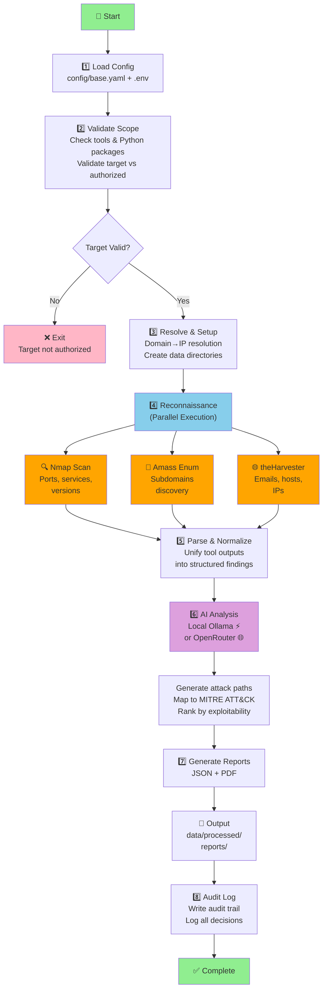

# ࿋ Sharingan — AI-Assisted Red Team Framework

## 📌 Overview

**Sharingan** is an AI-assisted offensive security framework that automates reconnaissance, analysis, and attack suggestions while complementing manual penetration testing.

> ⚠️ **Sharingan is not an autonomous hacking system.**  
> Human validation is required at every stage.

---

## 🎯 Objectives

- Automate recon & scanning
- Provide AI-driven attack suggestions
- Map findings to standard frameworks
- Generate structured security reports

---

## ⚖️ Toolset Split

### ⚙️ Sharingan (Automated)

- **Reconnaissance:** Nmap, Amass, theHarvester
- **Supplementary:** Shodan, ffuf, Wappalyzer, Nikto
- **Cracking:** John the Ripper
- **AI Backends:** Ollama (local) / OpenRouter (cloud)

👉 Used for speed, coverage, and pattern detection

### 🧠 Manual Tools

- **Burp Suite** (web app testing)
- **Aircrack-ng** (wireless)
- **Metasploit** (exploitation)

👉 Required for:

- Business logic flaws
- Advanced exploitation
- Context-based attacks

---

## 🧠 AI Strategy (Hybrid)

- **Local AI** → Fast, lightweight analysis (Qwen via Ollama)
- **Cloud AI** → Complex reasoning & scaling (OpenRouter/OpenAI)

---

## 🚀 Quick Setup

### Option 1: Poetry (Development)

```bash
# 1. Clone & navigate
git clone https://github.com/mUchiha26/Sharingan.git
cd Sharingan

# 2. Install Poetry (if not installed)
curl -sSL https://install.python-poetry.org | python3 -

# 3. Install dependencies
poetry install

# 4. Configure environment
cp .env.example .env
# Edit .env with your API keys (optional for local-only mode)

# 5. Run a test scan
poetry run python -m src.main --config
# Or interactive mode:
poetry run python -m src.main <target>
```

### Option 2: Docker (Production/Isolated)

```bash
# 1. Build the image
docker build -t sharingan:latest .

# 2. Run with volume mounts for data persistence
docker run -it --rm \
  -v $(pwd)/data:/app/data \
  -v $(pwd)/reports:/app/reports \
  -v $(pwd)/config:/app/config:ro \
  -e OPENROUTER_API_KEY=${OPENROUTER_API_KEY:-} \
  sharingan:latest --help

# 3. Run a scan (example)
docker run -it --rm \
  -v $(pwd)/data:/app/data \
  -v $(pwd)/reports:/app/reports \
  sharingan:latest -m src.main 10.0.0.5
```

---

## 📁 Project Structure

```
Sharingan/
│
├── src/
│   ├── main.py                  # CLI entry point
│   │
│   ├── ai/                      # 🧠 Intelligence Layer
│   │   ├── base_provider.py     # Abstract provider interface
│   │   ├── ollama_client.py     # Local LLM integration
│   │   ├── openrouter_client.py # Cloud LLM integration
│   │   └── prompt_templates/    # Prompt engineering
│   │
│   ├── core/                    # ⚙️ Core Components
│   │   ├── config_loader.py     # YAML → Pydantic config
│   │   ├── orchestrator.py      # Full recon workflow
│   │   ├── parser.py            # Tool output parsing
│   │   ├── target_resolver.py   # Target validation & resolution
│   │   ├── logger.py            # Unified logging + audit trail
│   │   ├── attack_decision_engine.py  # Findings analysis
│   │   └── nmap_wrapper.py      # Nmap with safety gates
│   │
│   ├── modules/                 # 🔧 Tool Wrappers
│   │   ├── recon/
│   │   │   ├── nmap_scan.py
│   │   │   ├── nmap_wrapper.py
│   │   │   ├── amass_enum.py
│   │   │   └── harvester.py
│   │   └── wireless/
│   │       └── aircrack_wrapper.py
│   │
│   ├── reports/                 # 📊 Report Generation
│   │   ├── generator.py         # JSON + PDF output
│   │   └── __init__.py
│   │
│   └── utils/                   # 🧰 Shared Utilities
│       ├── subprocess_manager.py
│       ├── validators.py
│       └── dependency_check.py
│
├── config/
│   ├── base.yaml                # Default configuration
│   └── mitre_attack_knowledge_base.json # ATT&CK mappings
│
├── data/
│   ├── raw/                     # Raw tool outputs
│   └── processed/               # Parsed findings
│
├── reports/                     # Generated Reports (JSON/PDF)
│
├── tests/                       # 🧪 Test Suite
│   ├── unit/                    # Unit tests per module
│   └── integration/             # End-to-end tests (WIP)
│
├── docs/                        # 📚 Documentation
│   ├── setup_guide.md           # Detailed setup instructions
│   ├── testing_guide.md         # How to run tests
│   └── design/                  # Architecture & design docs
│
└── pyproject.toml              # Poetry dependencies & config
```

---

## 🔄 Workflow

The framework executes a structured pipeline:



For details on configuration, see [config/base.yaml](config/base.yaml).

---

## 📊 Reporting

Each report includes:

- **Executive Summary** → Key findings & risk level
- **Vulnerability Details** → Port, service, version, potential exploits
- **MITRE ATT&CK Mapping** → Techniques detected
- **Attack Suggestions** → Ranked by exploitability
- **Remediation Roadmap** → Short-term & long-term fixes

Reports are generated in:

- **JSON** → For tooling & automation
- **PDF** → For stakeholder communication

---

## 🔐 Security Features

### Scope Enforcement

- Authorized targets configured in `config/base.yaml` or `.env`
- All tools validate targets before execution
- Fail-closed: invalid targets reject, not skip silently

### Logging & Audit Trail

- Unified logging across all modules
- Audit trail to `data/audit/audit.jsonl`
- Secret redaction (API keys, tokens, passwords)
- Structured logging for machine parsing

### Configuration Validation

- Pydantic v2 schema validation
- Environment variable interpolation
- Tool-specific argument allowlists
- Blocked dangerous arguments (e.g., `--script=exploit`)

---

## ✅ Testing

Run the test suite to validate all features work as expected:

```bash
# Install development dependencies
poetry install --with dev

# Run all tests
poetry run pytest

# Run specific tests
poetry run pytest tests/unit/test_nmap_wrapper.py
poetry run pytest tests/unit/test_config_loader.py

# Run with coverage
poetry run pytest --cov=src
```

See [docs/testing_guide.md](docs/testing_guide.md) for detailed testing strategy.

---

## 📖 Standards & References

- **NIST SP 800-115** – [Technical Guide to Information Security Testing](https://csrc.nist.gov/publications/detail/sp/800-115/final)
- **PTES** – [Penetration Testing Execution Standard](http://www.pentest-standard.org)
- **OWASP WSTG** – [Web Security Testing Guide](https://owasp.org/www-project-web-security-testing-guide/)
- **MITRE ATT&CK** – [Adversarial Tactics & Techniques](https://attack.mitre.org)
- **NIST AI RMF** – [AI Risk Management Framework](https://www.nist.gov/itl/ai-risk-management-framework)

---

## 🤝 Acknowledgments

- Open-source security community
- Contributors to Nmap, Metasploit, ffuf, and related tools
- AI platforms enabling intelligent automation

---

## 📬 Contact & Maintainers

| Name     | GitHub                                               | Role |
| -------- | ---------------------------------------------------- | ---- |
| Issra    | [@issraakrout](https://github.com/issraakrout)       |      |
| Rayen    | [@rayen-mansouri](https://github.com/rayen-mansouri) |      |
| Yasseene | [@mUchiha26](https://github.com/mUchiha26)           |      |

For collaboration or questions, open an issue or contact via GitHub.

---

## ⚠️ Disclaimer

**Sharingan is for educational and authorized testing only.**

Unauthorized access to networks and systems is illegal. Users are responsible for all actions taken with this tool. Developers assume no liability.

---

## ࿋ Final Note

Sharingan = **🤖 Automation + 🧠 Human Expertise = Effective Red Teaming**
